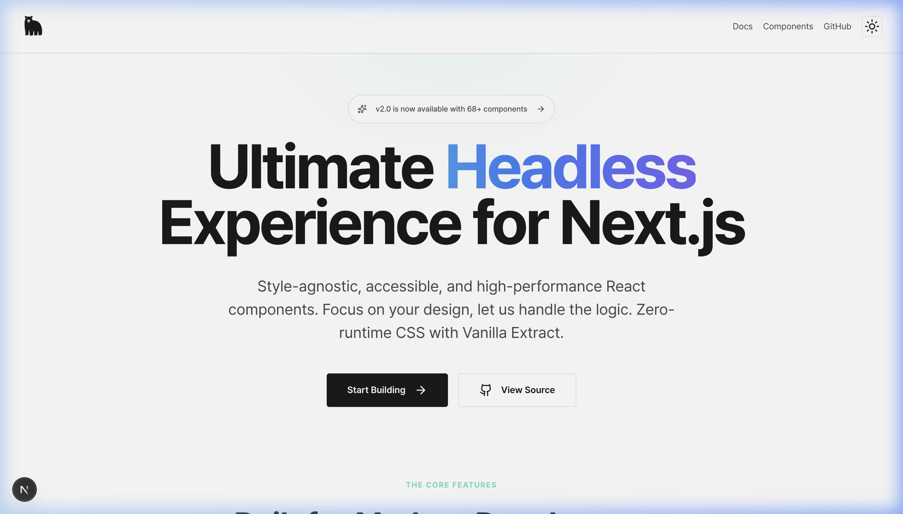
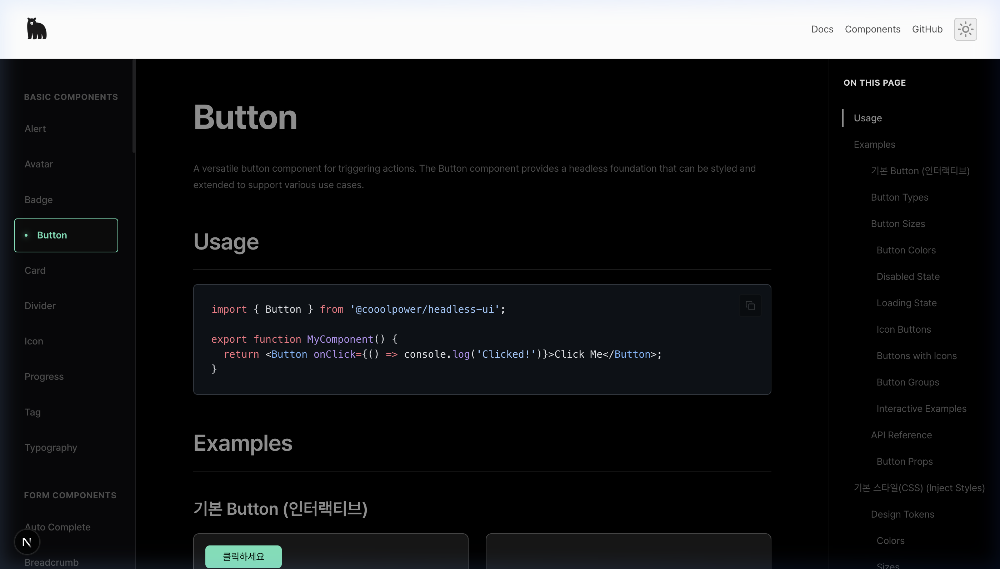
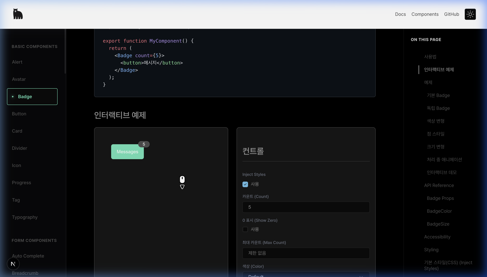

<div align="center">

# @cooolpower/headless-ui

**Ultimate Headless Experience for Next.js**

Style-agnostic, accessible, and high-performance React components.\
Focus on your design, let us handle the logic.

[](https://www.typescriptlang.org/)
[](https://react.dev/)
[](https://nextjs.org/)
[](https://vanilla-extract.style/)
[](LICENSE)
[](https://github.com/cooolpower/headless-playground)
[](https://pnpm.io/)
[](https://vanilla-extract.style/)

</div>

---

<div align="center">



</div>

## ✨ Features

- 🧩 **70+ Headless Components** — Logic-first, style-agnostic design
- ♿ **Accessible** — ARIA roles, keyboard navigation, focus management
- 🎨 **Optional Default Styles** — Toggle with `injectStyles` prop
- 🌗 **Dark Mode** — CSS custom properties based theming
- 📦 **Zero Config** — Just import and use, no setup required
- 🔒 **TypeScript Strict** — Full type safety with no `any`
- 🧪 **Interactive Playground** — Live preview with control panels
- 📖 **MDX Documentation** — Code examples + live demos in one place

---

## 📸 Screenshots

<table>
  <tr>
    <td width="50%">
      
      <p align="center"><sub><b>Component Documentation (Dark Mode)</b></sub></p>
    </td>
    <td width="50%">
      
      <p align="center"><sub><b>Interactive Playground with Controls</b></sub></p>
    </td>
  </tr>
</table>

---

## 🚀 Quick Start

```bash
# Install dependencies
pnpm install

# Build the UI library
pnpm --filter @cooolpower/headless-ui build

# Start dev server
pnpm dev
```

Open **[http://localhost:3000](http://localhost:3000)** to view the playground.

### Usage

```tsx
import { Badge } from '@cooolpower/headless-ui';
import '@cooolpower/headless-ui/styles.css'; // optional default styles

export function MyComponent() {
  return (
    <Badge count={5}>
      <button>Messages</button>
    </Badge>
  );
}
```

---

## 🧩 Components

<table>
  <thead>
    <tr>
      <th>Category</th>
      <th>Components</th>
    </tr>
  </thead>
  <tbody>
    <tr>
      <td><b>Basic</b></td>
      <td>Alert · Avatar · Badge · Button · Card · Divider · Icon · Progress · Tag · Typography</td>
    </tr>
    <tr>
      <td><b>Form</b></td>
      <td>Input · Textarea · InputNumber · AutoComplete · Cascader · Checkbox · Radio · Switch · Select · Slider · Form · Rate</td>
    </tr>
    <tr>
      <td><b>Data Display</b></td>
      <td>List · Table · DataTable · Descriptions · Statistic · Timeline · Tree · TreeSelect · Chart · Heatmap</td>
    </tr>
    <tr>
      <td><b>Navigation</b></td>
      <td>Tabs · Breadcrumb · Dropdown · Menu · Pagination · Steps</td>
    </tr>
    <tr>
      <td><b>Feedback</b></td>
      <td>Modal · Drawer · Dialog · Popover · Tooltip · Toast · Snackbar · LoadingBar · Empty</td>
    </tr>
    <tr>
      <td><b>Date &amp; Time</b></td>
      <td>Calendar · DatePicker · TimePicker · Countdown · FlipCountdown</td>
    </tr>
    <tr>
      <td><b>Layout</b></td>
      <td>PageHeader · FloatButton · Watermark</td>
    </tr>
    <tr>
      <td><b>Media</b></td>
      <td>Carousel · Image · Ellipsis · GradientText · QRCode</td>
    </tr>
    <tr>
      <td><b>Advanced Input</b></td>
      <td>DynamicTags · DynamicInput · Transfer · Upload · ColorPicker · Mention</td>
    </tr>
    <tr>
      <td><b>Other</b></td>
      <td>Collapse</td>
    </tr>
  </tbody>
</table>

> Each component includes: **Usage examples** · **Interactive playground** · **API reference** · **Accessibility notes** · **Default CSS snippet**

---

## 🛠 Tech Stack

<table>
  <tr>
    <td align="center" width="80"><br /><sub>Next.js 15</sub></td>
    <td align="center" width="80"><br /><sub>TypeScript</sub></td>
    <td align="center" width="80"><br /><sub>React 18</sub></td>
    <td align="center" width="80"><br /><sub>Vanilla Extract</sub></td>
    <td align="center" width="80"><br /><sub>MDX</sub></td>
    <td align="center" width="80"><br /><sub>Shiki</sub></td>
  </tr>
</table>

| Layer             | Technology                            |
| ----------------- | ------------------------------------- |
| **Framework**     | Next.js 15 (App Router)               |
| **Language**      | TypeScript (strict mode)              |
| **Monorepo**      | pnpm workspaces                       |
| **Styling**       | Vanilla Extract + CSS Custom Props    |
| **Documentation** | MDX + rehype-pretty-code (Shiki)      |
| **Build**         | tsup (library) · Next.js (playground) |
| **Deployment**    | Vercel                                |

---

## 📁 Project Structure

```
headless-playground/
├─ apps/
│  └─ playground/                  # Next.js documentation site
│     └─ src/
│        ├─ app/                   # App Router pages & layouts
│        ├─ components/            # Layout, Playground UI
│        ├─ content/components/    # MDX docs + demo files
│        └─ styles/                # Vanilla Extract global styles
│
├─ packages/
│  └─ ui/                          # @cooolpower/headless-ui
│     └─ src/components/
│        ├─ badge/
│        │  ├─ badge.tsx           # Component
│        │  ├─ badge.styles.ts     # Default CSS (optional)
│        │  ├─ type-badge.ts       # Type definitions
│        │  └─ use-badge.ts        # Hook (logic)
│        └─ ... (70+ components)
│
├─ pnpm-workspace.yaml
└─ package.json
```

---

## 🧠 Design Philosophy

| Principle          | Description                                             |
| ------------------ | ------------------------------------------------------- |
| **Headless First** | Components expose behavior, not styles                  |
| **Opt-in Styling** | Default CSS via `injectStyles` — override with your own |
| **Composition**    | Small, composable APIs over monolithic configs          |
| **Accessibility**  | ARIA, keyboard nav, focus trap built-in                 |
| **Type Safety**    | TypeScript strict, no `any`, explicit return types      |

---

## 📦 Why not Storybook?

This project intentionally avoids Storybook to:

- Demonstrate understanding of component documentation internals
- Control rendering and routing via Next.js App Router
- Integrate documentation directly with the app
- Explore MDX-driven UI patterns with a custom playground

---

## 📄 License

MIT © [cooolpower](https://github.com/cooolpower)
